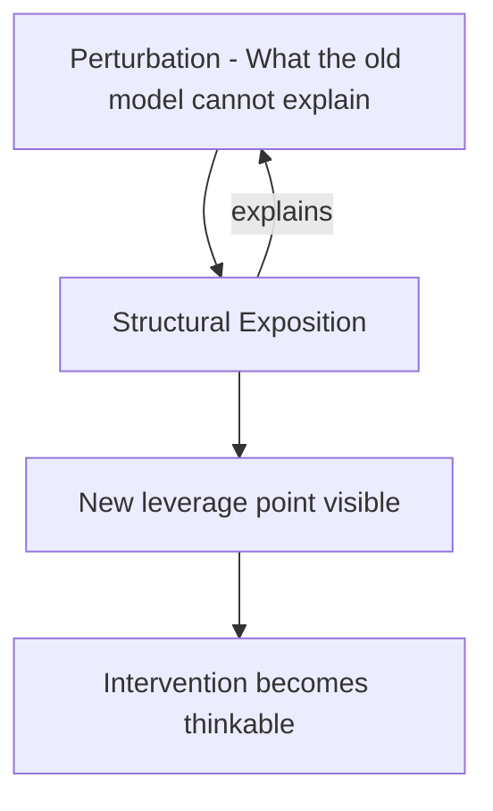

# Learner-First Systemic Learning

*A new framework for designing instruction in complex domains*

---

There is a persistent gap between how people are taught and how people actually learn. Most online instruction closes this gap by adding more content — more videos, more reading, more slides. The content is better organized, better produced, more accessible than ever. And yet transfer fails. Skills don't stick. Behavior doesn't change. The training is completed, the box is checked, and six months later the problem the training was supposed to solve is still there.

This is not a content problem. It is a structural problem. And like most structural problems, it is best understood through the lens of systems science.

---

## The Attractor Problem in Learning

In complex systems science, an attractor is a stable state that a system keeps returning to under perturbation. Push the system away from the attractor and it drifts back. This is not pathology — attractors are how systems maintain themselves in the face of noise, disruption, and change. They are the structural logic of stability.

Learning, properly understood, is an attractor-shifting process. When a learner holds a misconception — that organizations fail because of bad leadership, that feedback loops are optional features of complex systems, that chronic illness is primarily a matter of pathogen severity — that misconception is an attractor. The learner's understanding keeps returning to it. Correct information bounces off. Analogies don't stick. Confusion reconstructs itself after every explanation, because the feedback structure maintaining the wrong model has not been touched.

Traditional instruction does not address this. It delivers content, measures retention at the end of the lesson, and reports completion. The lesson may be pedagogically excellent and still fail to shift the attractor, because attractor-shifting requires something different from content delivery. It requires first identifying the current attractor, then applying a carefully sequenced set of perturbations that destabilize the wrong model, provide an alternative structural explanation, and establish the conditions under which the new model becomes self-sustaining.

This is what Learner-First Systemic Learning is designed to do.

---

## What Learner-First Means

The term carries a deliberate contrast with the dominant approach to instructional design, which is content-first: start with what needs to be taught, organize it logically, deliver it clearly, assess retention. Content-first is adequate for simple factual learning. It fails systematically for complex domains — domains where the learner needs not just more information but a genuinely different way of perceiving a situation.

Learner-First means starting with the learner's current mental model, not with the content. Before any instructional content is delivered, the learner's existing attractor must be surfaced and made visible — not as a test, not as a deficit to be corrected, but as the terrain that the instruction will need to traverse. The question is not "how do I organize this content so learners can receive it efficiently?" but "what attractor is the learner currently in, and what is the structural path from there to the expert attractor?"

This shift has profound implications for how courses are designed, how assessments are constructed, and how AI and simulation are deployed in the learning process.

Systemic means that the learning design treats the learner, the content, the instructor, and the learning environment as nodes in a feedback system — each influencing the others in ways that determine whether the attractor shift succeeds. It means that the design of a course is as much about the feedback structure connecting the elements as about the content of those elements. And it means that the learner's trajectory through the learning system is modeled explicitly, rather than assumed to follow the course outline.

---

## The Framework: Seven Phases

Learner-First Systemic Learning organizes each instructional module into seven phases. These are not linear steps — they are nodes in a feedback cycle that may be revisited as the learner's understanding develops.

### Phase 1: Surface the Attractor

The module begins with a task designed to reveal the learner's current mental model. This is not a pre-test. It is a model-revealing task — a scenario, a question, a brief prediction — whose purpose is to make the learner's existing attractor visible. The learner articulates what they currently believe, and the instruction now has a map of the terrain it needs to cross.

This phase is often skipped in traditional instruction. It is the most important phase in Learner-First design.

### Phase 2: Introduce the Perturbation

A case, observation, paradox, or simulation result is introduced that the learner's current mental model cannot explain. Not a contradiction — a gap. The existing attractor is revealed as insufficient. The learner is now in productive instability: the old model doesn't work, and the new one hasn't been introduced yet.

This phase creates the conditions for learning. Without it, new content is processed through the old attractor and either distorted to fit or discarded as irrelevant.

### Phase 3: Structural Exposition

The concept is introduced as a structural explanation for the perturbation in Phase 2. Not "here is the theory" — but "here is why the thing you couldn't explain works the way it does." The exposition is deliberately minimal: enough structure to account for the perturbation, not a complete theoretical treatment. Cognitive load is managed by limiting exposition to what is needed to explain the specific perturbation that was created.

### Phase 4: Simulation-Based Exploration

The learner directly manipulates a model of the concept. In an ISRD course, this means interacting with a simulation — adjusting parameters, observing emergent behavior, testing hypotheses. The goal is not to demonstrate the concept but to let the learner discover the dynamics. Understanding that emerges from direct manipulation is encoded differently from understanding that comes from reading or watching. It is more generative, more stable, and more transferable.

This phase is where simulation becomes an epistemological tool, not a demonstration aid. The learner is doing science, not watching it.

### Phase 5: AI-Facilitated Reflection

A structured dialogue follows the simulation phase. An AI tutor — operating within a pedagogical context defined by the course design — asks Socratic questions that probe whether the new model is operational. Can the learner apply the concept to a novel case? Can they identify the feedback structure in a real-world scenario? Can they predict the outcome of an intervention before running it?

This is the modern equivalent of the intelligent tutoring system: adaptive, responsive, capable of diagnosing which specific misconceptions remain and generating targeted counter-examples. It is practical now in a way that was prohibitively expensive in earlier eras of instructional technology.

### Phase 6: Transfer Challenge

The learner applies the concept to a new domain. The challenge is deliberately chosen to make the structural correspondence non-obvious — not "here is another feedback loop example" but "here is a situation from a completely different field; identify the attractor dynamics." This is where the isomorphism principle becomes a learning tool. Transfer that requires identifying structural correspondence across domains is more durable and more flexible than near-transfer to similar situations.

### Phase 7: Systemic Integration

The final phase explicitly connects the new concept to the broader course graph. What other concepts depend on this one? What does this concept enable that was not available before? The learner sees the feedback structure of the course itself — the dependency network connecting concepts — and updates their map of the domain. This is metacognitive by design: the learner is learning to model their own knowledge as a system.

---

## AI as Pedagogical Infrastructure

The AI layer in a Learner-First Systemic Learning course is not a chatbot. It is a pedagogical instrument with a defined role at each phase.

In Phase 1, AI analyzes the learner's pre-task response and classifies the attractor — which of the known misconception patterns is this learner operating from? This determines which version of the perturbation in Phase 2 will be most effective.

In Phase 5, AI conducts the Socratic dialogue using a context that includes the learning goals for this module, the learner's Phase 1 attractor classification, their simulation behavior in Phase 4, and a library of known misconceptions and their structural signatures. The dialogue is adaptive — not a fixed question sequence, but a genuine probe of whether the new model is operational.

In Phase 6, AI generates the transfer challenge, calibrated to the learner's demonstrated level of understanding. A learner who has confidently articulated the concept gets a harder structural correspondence challenge. A learner who is still uncertain gets a scaffolded version that makes the correspondence more visible.

In Phase 7, AI connects the current module to the learner's history across the course, surfacing specific earlier modules where the current concept provides new leverage. The course graph is navigated intelligently, not traversed linearly.

This is not science fiction. It is a carefully designed prompt architecture, a pedagogical context document, and an API connection. The expensive part was always the design of the pedagogical logic. The delivery infrastructure is now available.

---

## Simulation as Epistemological Tool

The role of simulation in Learner-First Systemic Learning is distinct from its conventional use in training. Simulation is not used to practice a procedure, demonstrate a concept, or provide an engaging alternative to reading. It is used because direct manipulation of a model is the most effective way to shift an attractor.

When a learner adjusts the balancing gain in a feedback loop simulation and watches the stock overshoot, oscillate, and settle — or fail to settle — they are building a mental model from their own hypothesis-testing, not from passive reception. The model they build is verified against their direct experience of the dynamics, not against a description of those dynamics. It is more accurate, more robust to challenge, and more likely to generalize.

ISRD's simulation toolkit is designed specifically for this purpose. The Feedback Loops, Lorenz Attractor, and Emergence simulations in the Foundry Simulations are not demonstrations — they are explorable model spaces. The ME/CFS Population Outbreak Simulator is an agent-based environment in which a learner can directly observe how systemic risk factors interact to produce an outcome that cannot be predicted from any individual factor. The macro-systemic simulations allow a learner to directly observe civilizational tipping points that resist any purely linear causal account.

Each of these simulations is a Phase 4 instrument. Their pedagogical role becomes clear when they are embedded in a course design that includes Phases 1-3 (establishing the attractor, perturbing it, providing structural exposition) and Phases 5-7 (reflection, transfer, integration). Without that context, they are interesting experiences. With it, they become attractor-shifting tools.

---

## Who Needs This

The framework has immediate applicability across a wide range of domains, each of which represents a client direction for ISRD:

**Health and medicine.** Clinicians, patients, and healthcare systems consistently fail to understand chronic and complex conditions because their mental models are built on linear causation. Feedback-based attractor models of conditions like ME/CFS, treatment-resistant depression, and metabolic dysfunction require exactly the kind of attractor-shifting that Learner-First Systemic Learning is designed to produce.

**Organizational development.** Leaders and change managers consistently apply interventions that trigger the policy resistance they are trying to overcome, because their mental models of organizations are linear. Shifting those models toward feedback-graph understanding is a training challenge that conventional L&D approaches cannot meet.

**Systems science education.** Teaching people to think systemically — to see feedback loops, attractors, and tipping points rather than causes and effects — is itself a major attractor-shifting challenge. The existing mental model (linear causation, isolated variables, reductionist analysis) is deeply stable and culturally reinforced.

**AI and technology literacy.** The most important misconceptions about AI are structural: people model language models as retrieval systems, as reasoning agents, as oracles. Understanding LLMs as networked complexity systems — the Era Four framing — requires the same kind of attractor-shifting as understanding any other complex system.

**Research methodology.** Complex systems require research approaches that are not based on controlled variable isolation. Teaching researchers to design for complexity — to work with attractor states, to use agent-based modeling, to interpret emergence — is a pedagogy challenge that Learner-First Systemic Learning is positioned to address.

In each case, the pattern is the same: a deeply stable wrong mental model, a domain of knowledge that requires a fundamentally different structural understanding, and a conventional training approach that delivers correct information without addressing the attractor maintaining the wrong model.

---

## What Comes Next

Learner-First Systemic Learning is both a framework and a research program. The framework is ready to be applied — the first courses are in design. The research program is beginning: ISRD intends to develop simulation-based attractor diagnostics, AI tutoring architectures calibrated to specific misconception patterns, and a formal model of the course-as-feedback-system.

The eventual goal is a toolkit for Learner-First Systemic Learning — an ISRD equivalent of the Sim-Toolkit, but for instructional design — that allows practitioners in any complex domain to design and deliver attractor-shifting instruction without requiring a large team, a significant budget, or deep expertise in learning technology. This is a direct extension of the ISRD mission: to build tools that work with complexity at the level complexity actually operates.

The course that follows — *SS 201: Introduction to Learner-First Systemic Learning* — is the first instantiation. It is itself designed using the framework it teaches.

---

*Kurt Rowley is the founder of ISRD. He holds a Ph.D. in Instructional Systems from Florida State University and has designed large-scale instructional systems for the US Air Force, Defense Acquisition University, and the US Navy. His research on expert instructional design practices (Rowley, 2005) forms one of the empirical foundations of the Learner-First Systemic Learning framework.*
