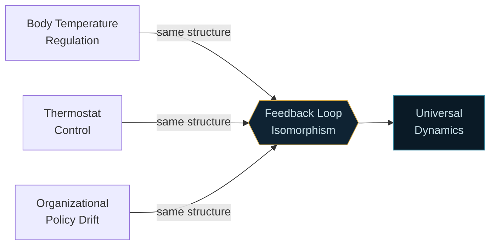
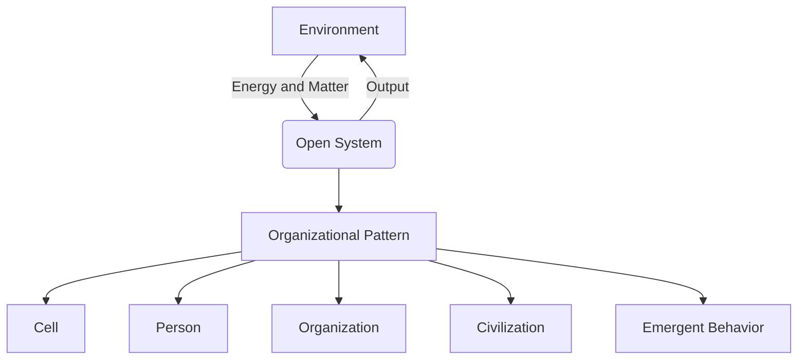
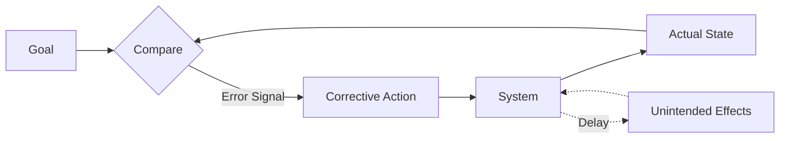
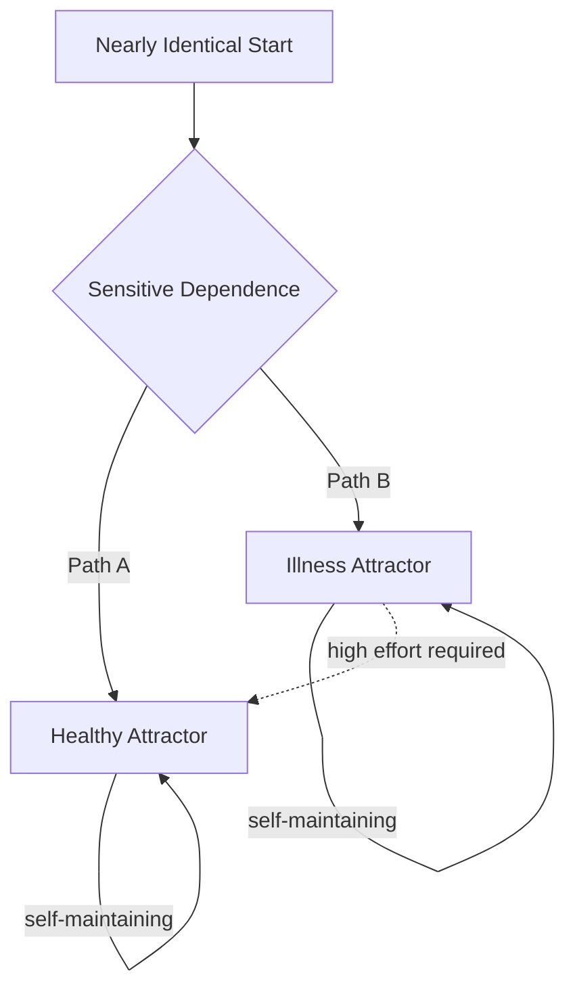
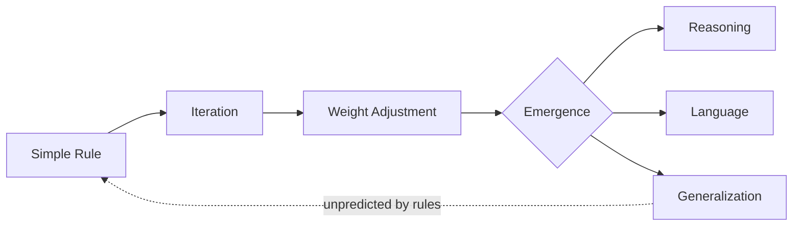
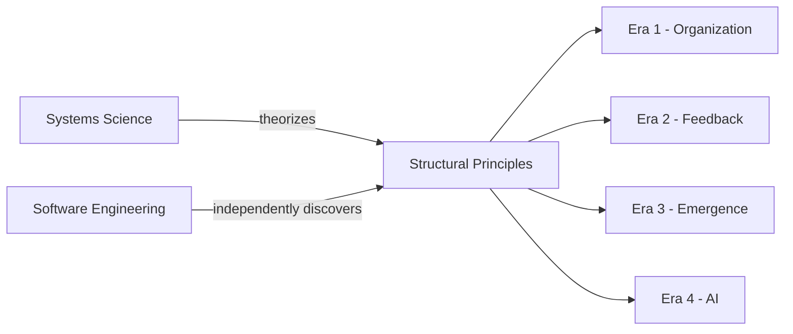
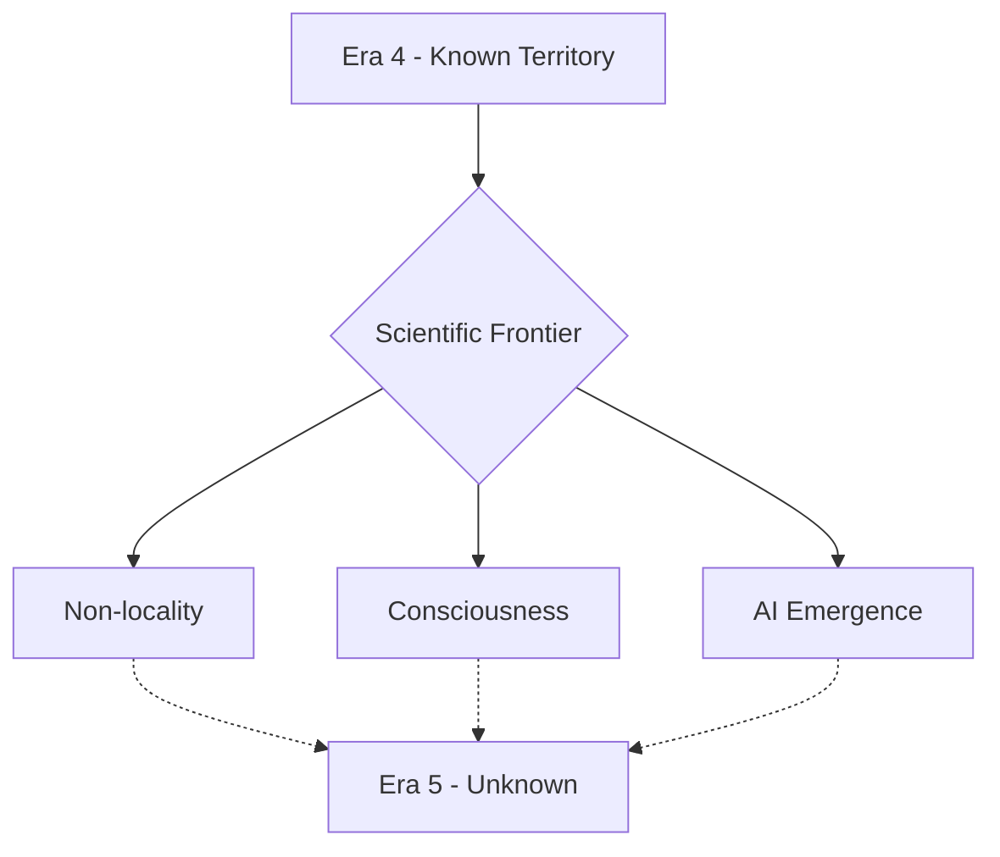

# The Four Eras of Systems Science

*About the scientific basis of ISRD methodology*

---

This history of science is full of one repeated cycle. A researcher in one field notices something that doesn't fit the standard framework. They look harder. They realize the anomaly isn't a problem with their data — it's a problem with the framework itself. The framework was built to explain a simpler version of reality than the one they're actually looking at.

Systems science began exactly that way. And it has repeated that pattern four times since, each time revealing a layer of reality that the previous framework couldn't see — and each time finding, with remarkable consistency, that the new layer had a specific and powerful isomorphism with human experience.

That word — isomorphism — is the conceptual spine of everything that follows. Two systems are isomorphic when they share the same underlying organizational structure even though their components are entirely different. The feedback loop that keeps your body temperature stable is isomorphic with the feedback loop that keeps a thermostat stable, which is isomorphic with the feedback loop that keeps a dysfunctional organizational policy in place year after year despite everyone's frustration with it. The math is the same. The dynamics are the same. The leverage points are in the same structural locations.

This matters because it means insights transfer. A principle derived from studying heat convection in the atmosphere turns out to describe the dynamics of chronic illness. A pattern identified in ecological population cycles turns out to explain why certain kinds of institutional reform always fail. The transfer isn't metaphor. The structural correspondence is real, and it's been independently rediscovered dozens of times across dozens of fields by researchers who weren't looking for it.

Scientific progress often includes multiple parallel discovery paths, sometimes different teams or individuals pursuing similar research trajectories. They may or may not even be aware of each other. This happened over the four eras of systems science evolution. While academic systems scientists were theorizing about feedback and complexity, working software engineers trying to solve practical computational problems were building systems that *exhibited* those exact properties. The computer and information world was repeating evolutionary cycles and rapidly learning from the results at a speed biological and social systems could never match. We will come back to that parallel later in this article because it is a fascinating dual path of progress in our understanding of systems in both natural and built environments. So in every era of the evolution of systems science, both systems science academics and the computer hardware and software world were learning rapidly about how systems work, moving through a similar set of stages.

With all that in mind, here is where the pattern of discovery has taken us so far.

---

## Era One: The Whole and Its Parts

Traditional science — the kind developed between the 16th and 20th centuries — is profoundly and deliberately reductionist. To understand something, you break it into its smallest components, study those components in isolation, and build your explanation from the ground up. This approach produced extraordinary results. Chemistry, physics, molecular biology, genetics — the reductionist program was one of the most successful intellectual projects in human history.

But it had a blind spot. It was exquisitely good at explaining what things *are made of*. It was much less good at explaining what things *do* — particularly when the behavior in question emerged from the interactions between components rather than from the components themselves.

Ludwig von Bertalanffy noticed this first, working in Vienna in the 1930s and 1940s. He was studying living organisms, and he kept running into the same problem: the behavior of an organism couldn't be predicted from the behavior of its parts, even if you knew the parts very well. Something was happening at the level of organization that the parts didn't contain. He began looking for the principles governing that level — and found them appearing everywhere: in physics, in economics, in social systems, in psychology. He called this General Systems Theory, and its central claim was radical: there are universal structural principles that apply to all organized systems, regardless of what they're made of.

Think of it this way: a computer's behavior is not explained by its transistors. The transistors are the hardware — necessary, but not sufficient. What the computer *does* is governed by the logic running on top of that hardware: the operating system, the software architecture, the rules for how components communicate. You could swap out every physical component and, if the organizational logic were preserved, the computer would behave identically. Bertalanffy was arguing that reality works this way too — that there is an organizational logic running across all complex systems, independent of what those systems are physically made of, and that understanding that logic was a new kind of science.

The isomorphism he identified at this level was abstract but profound. A cell, a person, an organization, and a civilization were all instances of the same underlying kind of thing: open systems maintaining themselves by exchanging matter and energy with their environment, organized hierarchically, capable of developing and adapting over time. The insight opened a new level of analysis that hadn't existed before: not the parts, not the whole, but the *organizational pattern* connecting them.

The practical utility at this stage was mostly theoretical. You could recognize the pattern. You could name it. But the tools for working with it were still primitive. The operating system had been identified. Nobody yet knew how to write programs for it.

---

## Era Two: Feedback, Control, and Counterintuition

The second era built on Bertalanffy's abstract framework and made it dynamic. Two parallel projects drove this: Norbert Wiener's cybernetics, developed at MIT in the 1940s, and Jay Forrester's system dynamics, developed at MIT in the 1950s and 1960s.

Wiener showed, with mathematical precision, that a specific mechanism — a system using information about its own outputs to regulate its behavior — appeared across wildly different contexts: thermostats, nervous systems, guided missiles, and social institutions. He called this mechanism feedback, and he showed that it was not just an analogy between these systems. It was the same process operating in different media. The feedback loop in a nervous system and the feedback loop in a social institution obey the same equations.

What made this concrete was the computer. Wiener wasn't working alongside computing by coincidence — he was part of the same intellectual milieu that produced it. A digital circuit is a feedback system in the most literal sense: logic gates compare input states and produce outputs that cascade through the system, each stage's output becoming the next stage's input, the whole chain governed by rules about how signals combine. The *if-then* logic that makes software work is feedback given formal structure. Wiener was essentially discovering the theoretical principle at the same moment engineers were building the hardware instantiation of it.

Forrester — who, strikingly, had invented magnetic core memory before he turned to system dynamics — took feedback into human organizations and economies, and discovered something counterintuitive: deterministic systems, governed entirely by known rules and known feedback relationships, consistently produce behavior that defies human intuition. They accumulate delays that make causes and effects appear unrelated. They exhibit oscillations nobody designed. They produce policy resistance — the well-intentioned intervention that makes things worse, not because it was poorly executed, but because it triggered compensating dynamics in the broader system that nobody had modeled. The same pattern that makes supply chains oscillate makes ecosystems collapse and makes organizational reform predictably fail.

Anyone who has debugged a complex piece of software will recognize this immediately. You fix the bug in module A. Two days later, module C starts failing in a way that has nothing obvious to do with your change. The system's feedback structure propagated your intervention in directions you didn't trace. The fix was correct locally. The system responded globally. This is not a software problem — it is a systems property that software makes visible faster than any other medium.

The isomorphism with human experience sharpened considerably at this level. The counterintuitive dynamics of deterministic systems — delay, oscillation, policy resistance, leverage points — mapped directly onto recognizable failures in organizations, healthcare systems, economies, and governments. For the first time, it was possible to build a formal model of a human system and run it forward in time, watching the dynamics unfold. The models were crude by today's standards, but they were predictive in ways that no prior framework had managed.

---

## Era Three: Complexity, Chaos, and the Edge of Prediction

In the 1980s, a third wave emerged from an unexpected direction: the mathematics of nonlinear dynamical systems. Researchers studying weather prediction, population biology, and fluid dynamics began finding something strange. Systems governed by simple, fully known rules could produce behavior that was — not approximately, but provably and permanently — impossible to predict beyond a certain time horizon. Small differences in initial conditions produced large differences in outcomes. The system was deterministic but not predictable.

This was chaos theory, and its most famous image is the Lorenz attractor.

Edward Lorenz was a meteorologist studying atmospheric convection. His three coupled differential equations — describing how air moves in a heated convection cell — produced a trajectory in phase space that never repeated but also never escaped. It traced a butterfly-shaped path forever: two lobes, each one a region the system was drawn toward, with the system circling from one to the other in patterns that looked almost regular but never quite were. Two trajectories starting from almost identical initial conditions would track together for a while, then diverge, ending up in completely different regions of the attractor.

Here is something worth sitting with: the Lorenz attractor is a program. Three equations, iterated forward in time with a tiny time step, over and over, millions of times. The butterfly shape is not stored anywhere in those equations. It *emerges* from the rules running forward. And critically: you can run the same program twice from starting positions that differ by a thousandth of a decimal place, and watch two identical-looking trajectories gradually pull apart until they're tracing entirely different regions of the attractor. The code is identical. The output diverges. This is not a bug. It is a mathematical property of the system — and it is the same property that makes two nearly-identical patients respond to the same treatment in completely opposite ways, and two nearly-identical organizations facing the same challenge end up in completely different states five years later.

The Santa Fe Institute, founded in 1984, became the institutional home for this work and extended it into what became known as complex adaptive systems science. The defining property of a complex adaptive system is that its components *learn and adapt* — they change their behavior based on their experience of the system's dynamics. This produced new mathematics: agent-based modeling, network theory, fitness landscapes, evolutionary dynamics in abstract spaces. And it produced a new vocabulary: attractors, basins of attraction, bifurcation points, tipping states, emergent behavior.

The isomorphism with human systems became specific rather than abstract at this level. A habit is an attractor — the system keeps returning to it even under pressure. A chronic illness that resists treatment is a system stuck in an attractor basin with steep walls, where each attempted intervention triggers compensating dynamics that restore the problematic state. An organization that repeatedly reconstructs the same dysfunctional culture despite personnel changes, restructuring, and genuine leadership effort is in an attractor state. The stability isn't a failure of effort. It's a structural property of the system — the same structural property visible in the Lorenz equations, the same one that appears when a large software system develops emergent failure modes that survive every attempted patch because the attractor is in the architecture, not in any individual component.

This is also the level where the Mandelbrot set entered the picture — arguably the most important single image in the history of systems science. Generated by an extraordinarily simple iterative rule applied to complex numbers — again, essentially a very short program — it produces a boundary of infinite complexity, with structure at every scale, never repeating, endlessly surprising. It demonstrated visually what complexity theorists were arguing mathematically: that simple rules, applied iteratively with feedback, generate complexity that cannot be predicted or pre-specified.

The practical problem with this era was the same as the previous one, amplified: complexity theory told you what to look for, but you needed data — vast amounts of it, at fine temporal resolution — to actually look. The concepts were right. The tools to make them operational at the scale of real human systems didn't yet exist.

---

## Era Four: Networked Complexity and the Neural Turn

The fourth era is the one we are living in, and its defining development is something that looked, for a long time, like it had nothing to do with systems science at all: the discovery that artificial neural networks, trained on sufficiently large datasets with sufficiently powerful computers, could learn to do things that nobody had explicitly programmed them to do.

The mathematics of neural networks had existed since the 1940s — since Wiener's era, not coincidentally. The conceptual framework — networks of simple processing units, weighted connections, learning through iterative adjustment of those weights based on feedback about errors — had been developed and largely abandoned twice before the current wave. What changed was not the theory. It was the scale of data and the speed of compute.

And what emerged, when those elements finally came together, was the most dramatic demonstration of the central theorem of complexity science that humanity has ever produced: simple rules applied iteratively with feedback, at sufficient scale, generate behavior that cannot be predicted from the rules. Nobody specified what a large language model would be able to do. Nobody programmed it to reason, to write poetry, to explain a technical concept in the style of a particular author. The rules said: take a network of weighted connections, show it sequences of text, and adjust the weights slightly based on how well the network predicts what comes next. That's the entire specification. Everything else emerged.

This is the same structure as a developing brain, an evolving ecosystem, a maturing organization, and — as we'll see in a moment — the entire seventy-year arc of software engineering itself. The isomorphism is not loose. It is mathematically precise. And the fact that we have now *built* systems exhibiting this class of behavior, at scale, and learned to work with them, means that we finally have practical infrastructure for engaging with complexity at the level complex systems actually operate.

More concretely: the combination of large language models, real-time data pipelines, cloud computing, and the simulation tools now available means that for the first time, a practitioner working on a complex human problem can build, run, and iterate on a formal model of that problem's actual dynamics — with the feedback structure, the attractor geometry, and the nonlinear response properties the real system has. The wait that complexity theory imposed — *the concepts are right but we can't operationalize them* — is over.

---

## The Parallel Track: Software as Accelerated Systems Science

Now for the thread that was foreshadowed at the start.

Running alongside each of the four eras described above — not as a consumer of systems science ideas, but as an independent and extraordinarily rapid source of the same discoveries — is the history of software engineering. Most systems scientists are not software engineers. Most software engineers do not think of themselves as systems scientists. The disciplines developed largely in parallel, with different vocabularies, different institutions, and different problems. But the isomorphism between what systems science discovered theoretically and what software engineering discovered empirically is among the most striking in the history of ideas.

And the reason it's striking is the timescale.

Biological evolution runs on generational time — decades, centuries, millennia. Social and organizational systems run on institutional time — years, decades. Software systems run on something closer to *clock time* — a development team can go through a complete cycle of design, implementation, failure, diagnosis, and redesign in a single day. A large software organization running continuous deployment may execute hundreds of such cycles before lunch. This means software engineering has accumulated empirical knowledge about the behavior of complex systems at a rate no other human discipline can approach. Every principle that systems science identified theoretically, software engineering encountered, struggled with, and developed practical responses to — faster, more concretely, and with more immediate consequences for getting it wrong.

Watch how this maps across the eras.

**In the 1960s**, programmers wrote sequential, monolithic code. Everything in one place, one instruction following another, the program as a single unified thing. This is the reductionist era of software — the equivalent of studying components in isolation. It produced working programs for problems that were small enough and well-defined enough that a single human mind could hold the entire system at once. When programs grew beyond that threshold, they failed catastrophically. The history of software disasters in this era is a history of reductionist assumptions colliding with systems-level reality.

**By the 1970s**, structured programming and modular design had emerged — not from theory, but from accumulated failure. Programs needed defined boundaries between components. Interfaces needed to be explicit. The internal logic of one module needed to be hidden from other modules, so that changes in one place didn't cascade unpredictably through the whole system. This is the software equivalent of Bertalanffy's organizational level: the discovery that the architecture — the pattern of connections — matters independently of what's inside any component.

**Through the 1980s and 1990s**, object-oriented programming extended this further: components could now encapsulate their own state, inherit behavior from parent structures, and compose into systems where emergent properties arose from the interaction of objects rather than from any object's individual logic. This is the software equivalent of complex adaptive systems — entities with their own internal rules, interacting with each other, producing system-level behavior from local dynamics.

**The agile era that followed** — weekly sprints, continuous integration, rapid iteration, fast feedback loops, deployment pipelines that could push changes and measure their effects within hours — is the software community's operational response to complexity dynamics. You cannot fully specify a complex system in advance because you cannot predict its behavior in advance. The only way to learn what the system will do is to build a version, run it in real conditions, observe the results, and adapt.

**And then there is AI itself.** Large language models are not just a product of software engineering — they are software engineering's most dramatic self-proof. The ground rules were set to be allegorical to neural networks: local processing units, weighted connections, iterative adjustment through feedback. Nobody specified the capabilities. The capabilities *emerged*.

The practical consequence is significant. Software engineering has developed, through brutal empirical selection, a body of knowledge about how to design, evolve, and govern complex systems that systems science is only beginning to formalize. Version control, modular architecture, defined interfaces, fast feedback loops, staged deployment, evolutionary iteration — these are not just good software practices. They are solutions to the general problem of building and maintaining complex systems in the presence of uncertainty, emergent behavior, and shifting requirements.

ISRD's simulation toolkit is, in part, an attempt to bring the software engineering learning rate to domains that have never had it — to let a clinician working on a chronic illness problem, or an organizational leader working on a persistent culture problem, iterate through model-and-test cycles at something closer to the speed software engineers take for granted, rather than the years-long cycles that biological and social systems normally impose.

---

## Era Five: What Comes Next

Four eras of systems science — and a parallel software track that compressed decades of discovery into years — have each revealed a new layer of structure in reality. Each layer turned out to have a precise isomorphism with some aspect of human experience that the previous framework couldn't reach.

There is a fifth layer visible on the horizon, though its full character isn't yet clear. It has to do with non-locality — with the possibility that the organizational principles governing complex systems operate in ways not fully captured by the local interaction rules we've been studying. Quantum entanglement demonstrates non-local correlation at the physical level. The holographic principle in physics suggests that information about a volume of space may be encoded on its boundary in ways that violate simple locality assumptions. Consciousness — the aspect of human experience most resistant to explanation at any of the first four levels — may turn out to require a framework that accounts for non-local structure in ways we don't yet know how to formalize.

Whether this involves something like invisible organizational blueprints operating through entanglement and emergence from quantum-level phenomena — whether it eventually makes sense to speak of quantum isomorphisms in the same way we speak of the feedback-loop isomorphisms of Era Two — remains genuinely open. The AI systems we've built at Era Four's leading edge already exhibit properties we can't fully account for mechanistically: representations that generalize across domains in ways that mirror human conceptual understanding, emergent capabilities that appear suddenly at scale thresholds. Whether this is merely complex-systems emergence well-understood in principle, or whether it points to something in Era Five territory, is a live question.

This is genuinely speculative. But speculation at the frontier of systems science has a good track record. Every era's central claim sounded overreaching at the time. Each turned out to be conservative.

---

## Why This Matters Now

The practical point of this history is not academic.

Every era of systems science has produced tools — ways of thinking, ways of modeling, ways of intervening — that turned out to be applicable to human problems the previous era couldn't address. And in every case, the tools arrived well after the theory: there was always a gap between recognizing the pattern and being able to work with it operationally.

That gap has closed, for the first time, at the complexity level. The theoretical frameworks of complex adaptive systems science — attractor dynamics, bifurcation, feedback networks, emergent behavior — are now matchable to the data and computational infrastructure needed to make them operational. The problems that resist solutions — treatment-resistant illness, organizational dysfunction that survives restructuring, social dynamics that amplify rather than correct — are, very often, problems at this level. They have been recognized as complex systems for decades. They can now be *modeled* as complex systems, and those models can be run forward, tested, and iterated.

The parallel track has given us something else: a proven methodology for working with complex systems under uncertainty. Build a version. Run it. Observe the attractor it finds. Adjust the structure — not the parameters, the structure — and run it again. Do this fast enough and you accumulate genuine knowledge about the system's dynamics, knowledge that no amount of prior theorizing could produce.

That is what ISRD is built to do. Not to describe complexity — the field has done that. To build tools that work with it: feedback-graph simulations that capture the structural dynamics of a problem, AI-assisted frameworks that help practitioners recognize the complexity signatures in their own situations, and an evolving methodology that treats intervention in complex systems as what it is — an engineering discipline with its own principles, its own failure modes, and its own accumulated knowledge about where the leverage is.

The simulation running in these labs is not a toy. The Lorenz attractor on your screen is a program — three equations running forward in time — and it is a window into a structural property that appears in the problems you're actually trying to solve. The feedback graph you build when you model a chronic illness or an organizational failure is a map of the maintaining dynamics: the reason the problem is still there despite every reasonable attempt to fix it. The attractor is in the architecture. That's where the intervention has to go.

The pattern is real. The transfer is legitimate. The tools are finally here.

---

*Kurt Rowley is the founder of ISRD — the Institute for Systemic Research & Development. ISRD builds simulation and modeling tools for problems with complex systemic structure.*
